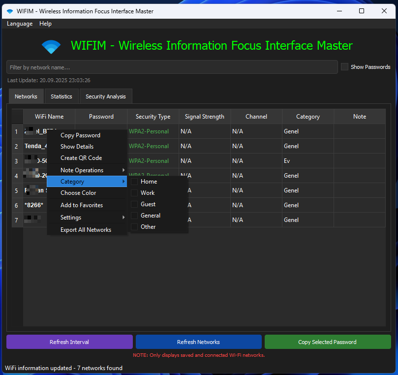
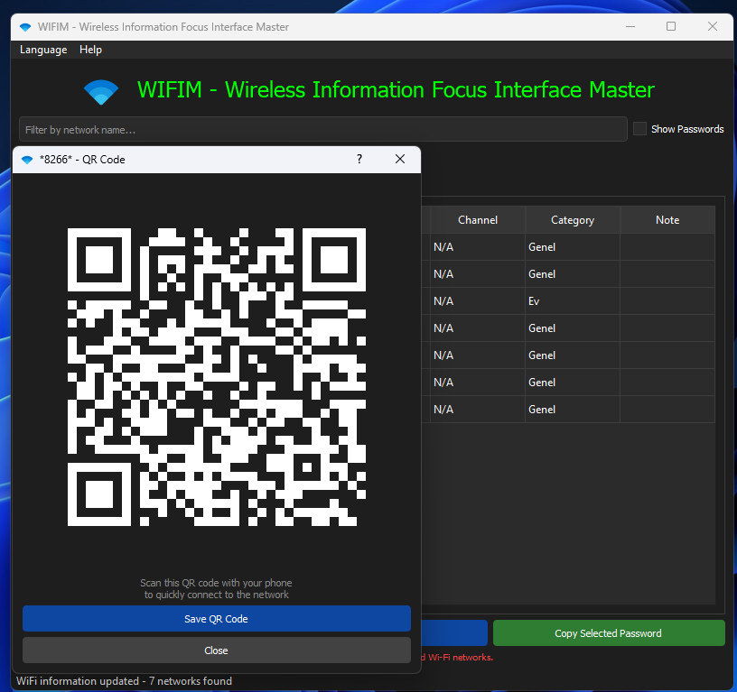
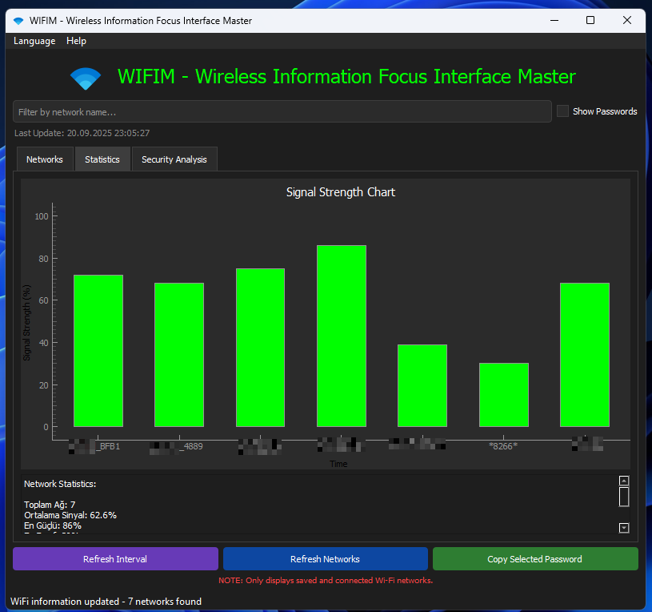
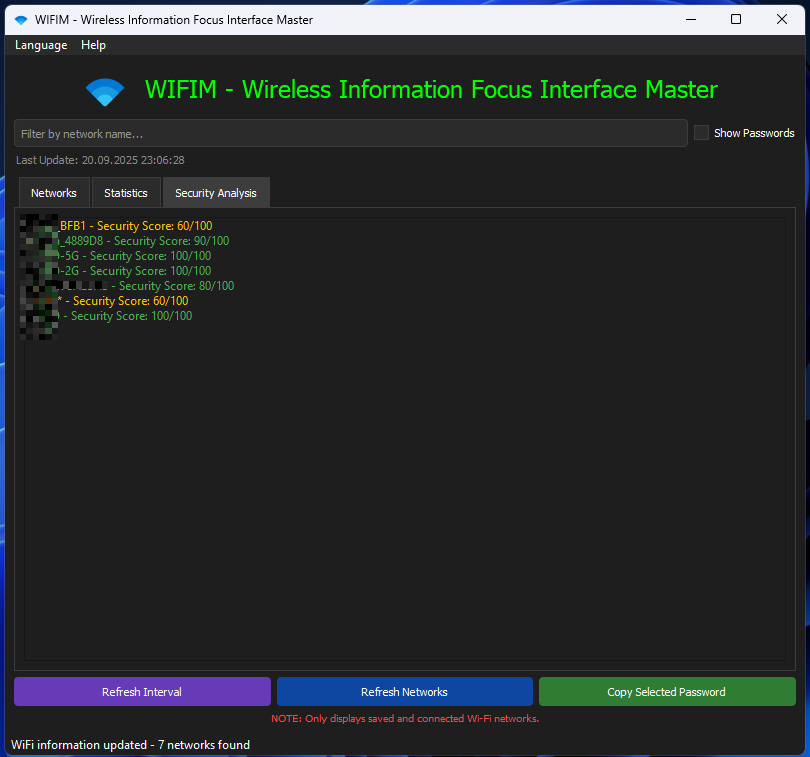

<a href="#">
    
</a>

# WIFIM - Wireless Information Focus Interface Master
This professional WiFi management tool allows you to view and manage detailed information about all wireless networks registered on your computer.

<h1 align="center">WIFIM Logo</h1>

<p align="center">
  
</p>

----------------------------------
# Windows Screenshots
  
  

  
  
--------------------

# To install directly on Windows

Windows Installer CMD (PowerShell): To Install from Windows CMD Using a Direct Link.
```bash
powershell -Command "Invoke-WebRequest -Uri 'https://github.com/cektor/WIFIM/releases/download/1.0.0/Setup_Win64.exe' -OutFile 'Setup_Win64.exe'" && start /wait Setup_Win64.exe
```


Releases Page: https://github.com/cektor/WIFIM/releases/tag/1.0.0
